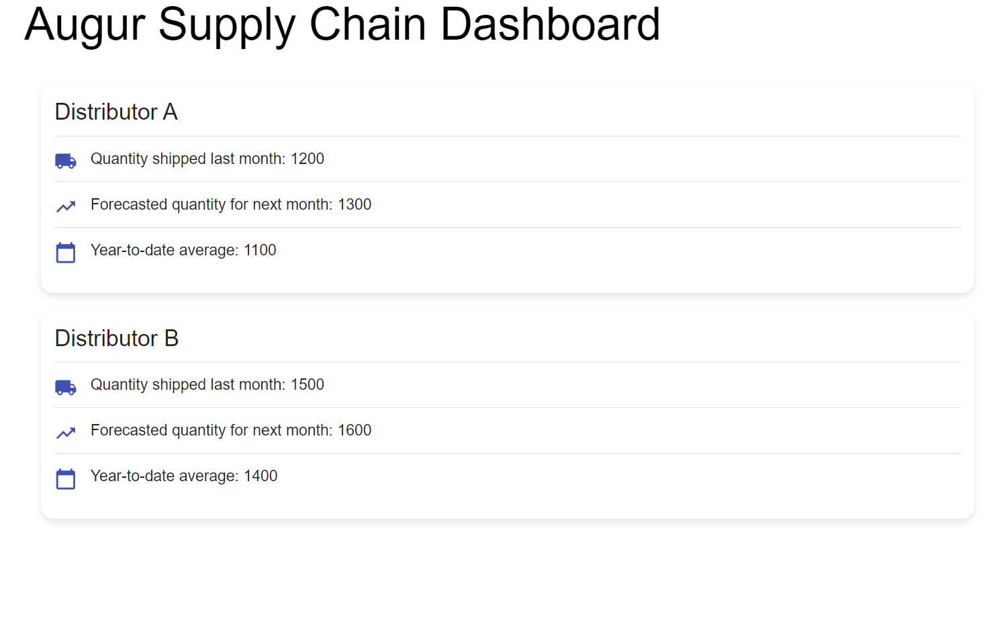

# Augur Supply Chain Dashboard

<<<<<<< HEAD
<div align="center">
  
</div>

Augur is a predictive supply chain management system designed to provide greater visibility into the decisions made by PepsiCo’s predictive shipping models. The system includes a browser-based dashboard that displays various metrics for PepsiCo’s distributors.

## Features

- Displays distributor metrics:
  - Name
  - Quantity of goods shipped last month
  - Forecasted quantity of goods to ship this month
  - Year-to-date average quantity of goods shipped
- Integrates with PepsiCo’s existing predictive shipping data pipeline
- Emphasizes extendibility for future enhancements

## Getting Started

### Prerequisites
- Node.js (which includes npm and npx)

### Installation
1. **Clone the repository:**
    ```bash
    git clone https://github.com/your-username/augur-frontend.git
    cd augur-frontend
    ```

2. **Install dependencies:**
    ```bash
    npm install
    ```

3. **Start the development server:**
    ```bash
    npm start
    ```

4. **Open your browser and navigate to:**
    ```
    http://localhost:3000
    ```

## Usage

- The dashboard displays mock data for now.
- Future integration with the backend will provide real-time data from the predictive shipping model.

## Contributing

1. **Fork the repository.**
2. **Create your feature branch** (`git checkout -b feature/AddedFeature`).
3. **Commit your changes** (`git commit -m 'added feature'`).
4. **Push to the branch** (`git push origin feature/AddedFeature`).
5. **Open a pull request.**

## Acknowledgements

=======
Augur is a predictive supply chain management system designed to provide greater visibility into the decisions made by PepsiCo’s predictive shipping models. The system includes a browser-based dashboard that displays various metrics for PepsiCo’s distributors.

## Features

- Displays distributor metrics:
  - Name
  - Quantity of goods shipped last month
  - Forecasted quantity of goods to ship this month
  - Year-to-date average quantity of goods shipped
- Integrates with PepsiCo’s existing predictive shipping data pipeline
- Emphasizes extendibility for future enhancements

## Getting Started

### Prerequisites
- Node.js (which includes npm and npx)

### Installation
1. **Clone the repository:**
    ```bash
    git clone https://github.com/your-username/augur-frontend.git
    cd augur-frontend
    ```

2. **Install dependencies:**
    ```bash
    npm install
    ```

3. **Start the development server:**
    ```bash
    npm start
    ```

4. **Open your browser and navigate to:**
    ```
    http://localhost:3000
    ```

## Usage

- The dashboard displays mock data for now.
- Future integration with the backend will provide real-time data from the predictive shipping model.

## Contributing

1. **Fork the repository.**
2. **Create your feature branch** (`git checkout -b feature/AddedFeature`).
3. **Commit your changes** (`git commit -m 'added feature'`).
4. **Push to the branch** (`git push origin feature/AddedFeature`).
5. **Open a pull request.**

## Acknowledgements

>>>>>>> origin/main
- Thanks to the team at PepsiCo for their support and feedback.